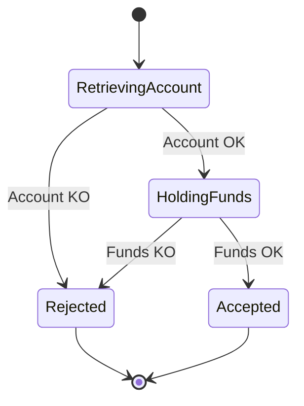

# Building a Finite-State-Machine Scala framework

# Introduction

Swan is Banking-as-a-Service (BaaS) processing tens of thousands payments everyday. As its core, it’s not a difficult task as it rarely involves complex business logic nor high performance. I’ve worked in the ad tech industry before where 150-200ms was the p95 we had to achieve on each incoming http request. What makes Swan interesting though, it’s that every payment should be consistent, auditable, resilient and simple.

Consistent because as a client you expect what you see on your account to makes sense. The money you have is the aggregation of all your transactions on your account. Every cent counts. There are businesses you can kill an ongoing process, considering it lost forever. When dealing with money, it’s not an option.

Auditable as you need to understand what happens at every stage of the processing because people will ask for it. Now, in two days but also in one month. Why did my payment fail two months ago? It was because you reached your spending limit at that time. You had 500EUR authorized and already spent. It was one of five checks Swan did for a total of 750ms. As you can see there is the business audit but also the technical audit with the processing time.

Resilient when at least one thing isn’t doing good in the system. The database can be unreachable, one provider can be down, etc. Still you need to display something to the user to let one know why the payments are not going through. They are not going through successfully but they still need to be presented to the end user, eventually. Once everything gets back up again, you need to catch up what you missed.

And simple, which is the hardest condition, because every developer isn’t a senior developer with 10 years of experience. The framework needs to make sure junior developers are less likely to do errors and to still enforce the requirements stated above. Simple to explain, simple to onboard, simple to maintain.

# Context

## Finite-State-Machine

I will use `FSM` (Finite-State-Machine) a lot in the next sections. For general definition please refer to [Wikipedia](https://en.wikipedia.org/wiki/Finite-state_machine) (and specifically [Moore FSM](https://en.wikipedia.org/wiki/Moore_machine) which will be the closest model we will implement). **In order to understand the code snippets in this article and the whole framework itself, you need to have a minimal knowledge of Scala and functional programming**. 

What is a FSM framework? In this case, a description of a high level synchronous request/response process with all possible reachable states. Think about all the steps/side-effects/external calls/etc your program has to do in order to process and request and send back a response. 

Today, most of the payment workflows at Swan are built the same way. They all have the same requirements, use the same concepts and share the same codebase. They are built on top of a FSM framework, iterating from an initial state until it reaches a final state. It usually starts from an Empty state with data extracted from a request (coming from http, kafka, etc). Then for each state, we associate an external call to a service (such as getting the user & verify rights, calling a provider, etc) and save a new state. This transition often has two possible outcomes, a rejected one and an accepted one. Like `UserNotFound` vs `UserFound`, or `UserAuthorized` vs `ForbiddenError`. Rejecting is a fail-fast mechanism and it completes the request. On the other hand if you get into a new state, you repeat calling an external service and switching to a next state until you reach a final state.

But today, we’re not 100% satisfied with the curent framework running in production. As we’ve been perfecting this over the 5 last years, it’s pretty clear what we want to ensure and it will be explained later. **Let’s build together the next FSM framework we would like to use at Swan**. 

## Authorize a card payment

As we are building the FSM framework, we’ll use the case of authorizing a card payment as our implementation. We’ll make sure the framework provides everything we need in order to achieve both our business implementation and some technical guarantees. It’s a slightly modified version of what we do at Swan, but it covers everything we need. More than a door-FSM or a coffee-machine-FSM, we will treat this case as something we will deliver to production at some point.

### Business workflow

This example should be pretty straightforward. If I had to describe this in plain English it would be something like: When Swan receives an incoming card payment authorization, it has to accept or reject the card authorization. To do so, the first step is to get the account linked to the card doing the payment. We’ll use a `cardId` here but in real life it would be a PAN (Primary Account Number, the numbers on your credit card) or an obfuscated PAN. After verifying that the account "is OK" (whatever that means, checking if the account is not closed, checking that the card isn't expired, etc), Swan tries to hold the funds on the client account. If there are enough funds, then the authorization is accepted. In case any verification fails, the authorization is rejected.

On each state we either need a response from an external system to move to the next state or it’s a final state and we can get out of the FSM. It means that we have two kind of states. On intermediate ones, we will need an extra information to get one of the possible events to move on. 

### Technical guarantees

Now that it’s clear what we want to design from a business point of view, we also want some technical guarantees. 

First, we need to make sure the FSM reaches a final state. The risk of being stopped in the middle is that we will be holding funds on a client account without ever validating the authorization from an external point of view. Basically you have less money available on your account but you still were not able to pay. Not so good hun.

We also need idempotency along the way. We cannot guarantee that all of your external calls support an idempotent mechanism but we can protect as much as possible the flow. What if we retry the FSM because the process crashed but we already did step 1 and trying it again would branch to `AccountKO` instead of `AccountOK`? We'll use `checkpoints` or persistence of some states to make sure some decisions are only taken once. 

This gives us actions to do, either by entering on a state or exiting a state for a new state.

| State | When (Entering or Exiting state) | Why | Description |
| --- | --- | --- | --- |
| RetrievingAccount | Entry | Technical action for consistency | Save the initial request for future periodic checks until the FSM reaches a final state. |
| RetrievingAccount | Exit | Technical action for idempotency & performance &  auditability | Save the next state (Rejected, HoldingFunds) so if a FSM is restarted, we don’t start from the beginning again. |
| HoldingFunds | Exit | Technical action for idempotency & performance & auditability | Save the next state (Rejected, Accepted), same reason as before. It avoids running the FSM again in case the same request is processed again. |
| Rejected | Accepted | Entry | Technical action for consistency | Remove the request from the periodic check as we reached a final state |
| Rejected | Accepted | Entry | Business action, as part of broadcasting events into the system | Publish a Kafka message to broadcast the information that an authorization has been made. |

# Requirements

In this article we will try to create a generic framework developers can use in order to create payment workflows with the guarantees we have on the system. The list of requirements will be the following:

- The FSM should be compile-time checked. We want everybody to be able to develop their own FSM and get as much help as possible from the compiler. It means that invalid transitions should not be possible. It also means that the design should be exhaustive enough to warn the user when something is missing or goes wrong.
- The FSM should be focused on writing business code. Every generic development such as observability (logging, monitoring, tracing), persistence, etc should be composable with the business code but should not be part of the business code if not needed.
- The FSM should focus on small blocks and be composable. By using composition, it’s easier to think about unitary tasks and then combine them. It also eases the testing and force the developer to identify clear steps. If you know how to deal with State1 and how to deal with State2, knowing that State1 + State2 compose your final use-case, then composing them in a safe way is something you should be able to do.
- No magic. The FSM is descriptive and explicit. Nothing happens under the hood. We want developers to be aware of everything that happens in their code. You didn’t ask for a logging? Then nothing will output. You didn’t explicit ask a persistence? No effect then. Remember the resilience part with persisting intermediate steps? We are currently running a system with an implicit/hidden persistence and it’s not the best idea, even if it works as intended. People are missing a behavior because it’s not explicit in what they code.
- The FSM should be extendable easily. Adding a new step/state, updating an existing step by adding a new condition/event or anything should not lead to cascade modifications. It should be possible to add temporary steps, A/B steps, etc. An example could be using a hierarchy of trait/classes. Trying to get a generic representation is something that could prevent us achieving that for instance. Adding a new case to an enum could force us to update existing parts of the code and lead to unnecessary pattern match with no real solution on how to proceed.
- We want developers to focus on business code but we want the code to be production ready. This means tooling, instrumentation, obversability, you name them. It should be as simple as adding a `.log` or `.trace` on a business FSM.
- We don’t want fancy librairies, fancy concepts. We only pull what we need to. We document as much as possible what could be a little bit hard to understand and we keep in mind that junior developers could have to update this framework. It should be easy to use, easy to maintain. But we would like to onboard people into the magical FP world.
- [bonus] We should be able to generate a self description of the FSM into a state diagram so we have an out-of-the-box documentation by just coding. Isn’t that nice?

Rendez-vous in Part 2. for the minimal business implementation.