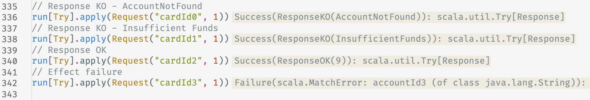

# Building a Finite-State-Machine Scala framework

# Implementation

In this part we’ll only cover a few requirements. We will provide a compile-time checked FSM algebra and program. It means describing the FSM using types, enforcing a strong consistency on states and transitions. As well as compiling this algebra into a runnable function for the execution of the FSM. Observability, tooling, resilience, bonus points will come in a third part.

Little disclaimer for the implementation. I used terminology borrowed from the [Tagless Final](https://www.baeldung.com/scala/tagless-final-pattern#the-tagless-final-pattern) approach. This means you need to have a basic knowledge of [Tagless Final](https://www.baeldung.com/scala/tagless-final-pattern#the-tagless-final-pattern) to properly get what will be happening next. It’s not that much, don’t worry. If you’re able to read `def myfunc[F[_]: Monad, A](env: Env[F]): F[A]` you should be good to go. We'll also have a little bit of recursion but that shouldn't be very hard. 

All the snippets below only rely on one library, `cats-core`. Including the dependency and running the snippets locally either with a SBT project, an ammonite shell, a worksheet or a scastie should compile properly.

## Model the business

```scala
// Request
//   cardId = the card we want to authorize a payment on
//   amount = the price of the payment
case class Request(cardId: String, amount: BigDecimal)
enum Response {
  case ResponseKO(reason: String)
  case ResponseOK(balance: BigDecimal)
}

// Intermediate states & associated inputs
// CheckingAccount
case class RetrievingAccount(cardId: String, amount: BigDecimal)
case class AccountKO()
case class AccountOK(accountId: String)
// HoldingFunds
case class HoldingFunds(cardId: String, amount: BigDecimal, accountId: String)
case class FundsKO(balanceBefore: BigDecimal, balanceAfter: BigDecimal)
case class FundsOK(balance: BigDecimal)

// Final states
enum Reason { case AccountNotFound; case InsufficientFunds }
case class Rejected(cardId: String, amount: BigDecimal, reason: Reason)
case class Accepted(cardId: String, amount: BigDecimal, accountId: String, balance: BigDecimal)
```
[https://gist.github.com/AlixBa/cce5d9e29bdfadae44b14683ed5394a9](https://gist.github.com/AlixBa/cce5d9e29bdfadae44b14683ed5394a9)

As we’ve seen in the context, this is what we have to build our FSM. I’ve added Request and Response to separate the domain from the external caller. The Response type is not perfect but the idea is to show that we don’t want to return the full final state but rather something lighter with only the properties needed to continue the process. Making available only necessary stuff help making testing/mocking easier.

## Alias for a better comprehension

```scala

// A function to apply on a state S with a discarded return value.
type Action[F[_], S] = S => F[Unit]

// A function to apply on a state S to get the external input I
// used to later trigger the transition to the next state.
type Input[F[_], S, I] = S => F[I]

// A transition function from a state S0 and an input I
// to a new state S1.
type Transition[S0, I, S1] = (S0, I) => S1

// A transformation from a state S to an output O.
type Output[S, O] = S => O
```
[https://gist.github.com/AlixBa/35f493b1495c9324f9cfae9e2f271643](https://gist.github.com/AlixBa/35f493b1495c9324f9cfae9e2f271643)

Nothing special here. We’ve talked about Action in the Entry or Exit action of the resilience part, even though it can be used for more than resiliency. The Input alias will be used to get possible events to transition from an intermediate state to the next state. The Output alias is the exiting function. As we’ll have business states in the FSM, we might want to map the output to a Result type more than a state of the FSM, this is what Output will be used for.

## Define the algebra

```scala
// A generic algebra on a state S with an output O in an effect F.
sealed trait StateAlgebra[F[_], S, O]

// State0 is a output node in a FSM. From a state S to an output O.
// An entryAction is executed when a transition is made to state S.
trait State0Algebra[F[_], S, O] extends StateAlgebra[F, S, O] {
  def entryAction: Action[F, S]
  def output: Output[S, O]
}

// State1 is a node with a single transition in a FSM. From a state
// S0 to a state S1 using an input I. A transition is made using both
// state S0 and input I to move to state S1. Then another algebra A 
// starting from state S1 with an output O1 describes the next step.
// An entryAction is executed when a transition is made to state S0.
// An exitAction is executed when we get off state0 to state1.
trait State1Algebra[
  F[_], S0, I, S1, O1,
  A <: StateAlgebra[F, S1, O1]
] extends StateAlgebra[F, S0, O1] {
  def entryAction: Action[F, S0]
  def input: Input[F, S0, I]
  def transition: Transition[S0, I, S1]
  def exitAction: Action[F, (S0, S1)]
  def next: A
}

// State2 is a node with a conditional branching in a FSM. From
// a state S0 to either a state S1 or S2 using an input I. A transition
// is either made to state S1 or state S2 using both the state S0 and 
// the input I. Depending if state S1 or state S2 is the next step,
// algebras A1 and A2 describe what happens next.
trait State2Algebra[
  F[_], S0, I, S1, O1, S2, O2,
  A1 <: StateAlgebra[F, S1, O1],
  A2 <: StateAlgebra[F, S2, O2]
] extends StateAlgebra[F, S0, O1 | O2] {
  def entryAction: Action[F, S0]
  def input: Input[F, S0, I]
  def transition: Transition[S0, I, S1 | S2]
  def exitAction: Action[F, (S0, S1 | S2)]
  def next1: A1
  def next2: A2
}
```
[https://gist.github.com/AlixBa/98c8af964b1090f4f34803ee6e72b5ae](https://gist.github.com/AlixBa/98c8af964b1090f4f34803ee6e72b5ae)

Things start to be interesting as of now. We said that we had 2 different kind of states in our FSM. Final states and intermediate states. 

Final states will be supported by `State0Algebra`. It’s a state with an entryAction and a mapping into a final type. Nothing can be done after that on this FSM. Intermediate states have different shapes. We’ll stop at 2 possible next states but it can be easy to implement State3, State4, …. The logic remains the same. I decided to keep track of all the types as it will be useful for what we want to do next. The cons of this is that the types are becoming noisy already at State2.

You might be wondering what is the type associated to the FSM we’re trying to build? There you go. It’s pretty self descriptive but it involves a lot of types. If you already are thinking about “this is not composable nor modulable”, don’t worry, we’ll fix this later.

```scala
// FSM with 2 potential next states
def fsm[F[_]]: State2Algebra[
  // State: RetrievingAccount
  F, RetrievingAccount,
  // Input: AccountKO | AccountOK
  AccountKO | AccountOK,
  // Transition to state Rejected with output Rejected
  Rejected, Rejected,
  // Or transition to state HoldingFunds with output Rejected | Accepted
  HoldingFunds, Rejected | Accepted,
  // FSM with no next state output to Rejected
  State0Algebra[F, Rejected, Rejected],
  // FSM with 2 potential next states
  State2Algebra[
    // State: HoldingFunds
    F, HoldingFunds,
    // Input: FundsKO | FundsOK
    FundsKO | FundsOK,
    // Transition to state Rejected with output Rejected
    Rejected, Rejected,
    // Or transition to state Accepted with output Accepted
    Accepted, Accepted,
    // FSM with no next state
    State0Algebra[F, Rejected, Rejected],
    // FSM with no state
    State0Algebra[F, Accepted, Accepted]
  ]
] = ???
```
[https://gist.github.com/AlixBa/4601d03d1809c93ba7d82a75bed6088c](https://gist.github.com/AlixBa/4601d03d1809c93ba7d82a75bed6088c)

## Run the algebra

For the moment we only described what our FSM was doing. It’s common (and good) practice to separate the definition from the execution. For each type of algebra we just need to define the resulting function from the starting state of the FSM.

```scala
// A program to compile the algebra into a `run` function.
// Depending if the algebra is State0, State1, State2, the execution
// will be different. As an algebra can chain with another algebra, we'll
// use a recursive resolution to build the program.
trait StateProgram[F[_], S, O, A <: StateAlgebra[F, S, O]] {
  def run(algebra: A)(s: S): F[O]
}

// As we're going to reference an existing algebra to build a program,
// we'll use this trait to avoid repeating algebra twice.
// `program(myAlgebra).run(myAlgebra)(s)` would be redundant.
trait StateProgramWithAlgebra[F[_], S, O, A <: StateAlgebra[F, S, O]]
  extends StateProgram[F, S, O, A] {
  def algebra: A
  def run(s: S): F[O] = run(algebra)(s)
}

given state0Program[F[_] : Functor, S, O]:
  StateProgram[F, S, O, State0Algebra[F, S, O]] =
  new StateProgram[F, S, O, State0Algebra[F, S, O]] {
    override def run(algebra: State0Algebra[F, S, O])(s: S): F[O] = {
      algebra
        // first we execute the entryAction.
        .entryAction(s)
        // then we map the state S to output O discarding
        // the entryAction return value (unit).
        .map(_ => algebra.output(s))
    }
  }

given state1Program[
  F[_] : FlatMap, S0, I, S1, O1,
  A <: StateAlgebra[F, S1, O1]
](using
  programA: StateProgram[F, S1, O1, A]
 ): StateProgram[F, S0, O1, State1Algebra[F, S0, I, S1, O1, A]] =
  new StateProgram[F, S0, O1, State1Algebra[F, S0, I, S1, O1, A]] {
    override def run(
      algebra: State1Algebra[F, S0, I, S1, O1, A]
    )(s0: S0): F[O1] = for {
      // first we execute the entryAction.
      _ <- algebra.entryAction(s0)
      // then we get the external input I.
      i <- algebra.input(s0)
      // we apply the transition from state S0 to state S1 using input I.
      s1 = algebra.transition(s0, i)
      // we trigger the exitAction.
      _ <- algebra.exitAction((s0, s1))
      // and we execute the algebra of the next state S1 with output O1.
      o1 <- programA.run(algebra.next)(s1)
    } yield o1
  }

given state2Program[
  F[_] : FlatMap, S0, I, S1: ClassTag, O1, S2: ClassTag, O2,
  A1 <: StateAlgebra[F, S1, O1],
  A2 <: StateAlgebra[F, S2, O2]
](using
  programA1: StateProgram[F, S1, O1, A1],
  programA2: StateProgram[F, S2, O2, A2]
 ): StateProgram[F, S0, O1 | O2, State2Algebra[F, S0, I, S1, O1, S2, O2, A1, A2]] =
  new StateProgram[F, S0, O1 | O2, State2Algebra[F, S0, I, S1, O1, S2, O2, A1, A2]] {
    override def run(
      algebra: State2Algebra[F, S0, I, S1, O1, S2, O2, A1, A2]
    )(s0: S0): F[O1 | O2] = for {
      // nothing different from State1 here.
      _ <- algebra.entryAction(s0)
      i <- algebra.input(s0)
      s1s2 = algebra.transition(s0, i)
      _ <- algebra.exitAction((s0, s1s2))
      // as we're using a union type, and it will be erased at runtime
      // we have to get ClassTag[S1] and ClassTag[S2] to properly match.
      // then we trigger the correct next algebra
      o1o2 <- s1s2 match {
        case s1: S1 => programA1.run(algebra.next1)(s1).map(identity)
        case s2: S2 => programA2.run(algebra.next2)(s2).map(identity)
      }
    } yield o1o2
  }
```
[https://gist.github.com/AlixBa/6ffe56de3a0c7ea110ec919c3b9a76c1](https://gist.github.com/AlixBa/6ffe56de3a0c7ea110ec919c3b9a76c1)

I’ll highlight two things here. The first one is that we’re using recursion and implicit instances to build our StateProgram. We’re trying to keep as much information as possible even when compiling the program because we’ll want to wrap this program and its algebra with custom behavior, later. I don’t know if it’s a good practice but I found it to be useful. 

Second, you can see a little bit of cats-core with `Functor` and `FlatMap`, along with a ClassTag because of the erasure limitation on union types. And voila, we're done. That's basically all we'll need to run a compile-time checked in-memory implementation of any FSM.

```scala
// implicitly constructing the program from an existing algebra  
def program[F[_], S, O, A <: StateAlgebra[F, S, O]]
  (alg: A)(using program: StateProgram[F, S, O, A]): 
  StateProgramWithAlgebra[F, S, O, A] =
    new StateProgramWithAlgebra[F, S, O, A] {
      override def algebra: A = alg
      override def run(algebra: A)(s: S): F[O] = program.run(algebra)(s)
    }

// what we would use eventually to run the FSM
def run[F[_]]: Request => F[Response] = request =>
  program(fsm[F])
    .run(RetrievingAccount(request.cardId, request.amount))
    .map {
      case rejected: Rejected => Response.ResponseKO(rejected.reason.toString)
      case accepted: Accepted => Response.ResponseOK(accepted.balance)
    }
```
[https://gist.github.com/AlixBa/3242ecc51fb34712eb16015e5c739f0b](https://gist.github.com/AlixBa/3242ecc51fb34712eb16015e5c739f0b)

## Playground time

In this [scastie](https://scastie.scala-lang.org/5AzKCPqdRpO5OvQll8Gmww) you’ll find everything we talked about in this chapter. 



Results running our card authorization FSM

We've not yet demonstrated the full type checking over this but trust me, if you don't try to trick the system, you're pretty safe about the compiler helping you as much as possible. As you can see, avoiding any class hierarchy here makes it easy to reason about pattern matching and makes things explicit. Each transition from state S1 to state S2 is typed and explicit and the type system ensure that you provide a correct mapping function from S1 to S2 using the input you got from any external source.

See you in Part 3. to improve this FSM with some production requirements as well as a better modularity over the definition and testing.