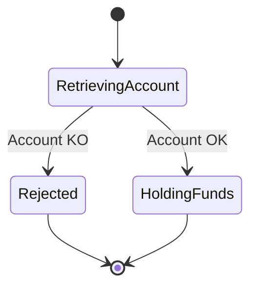
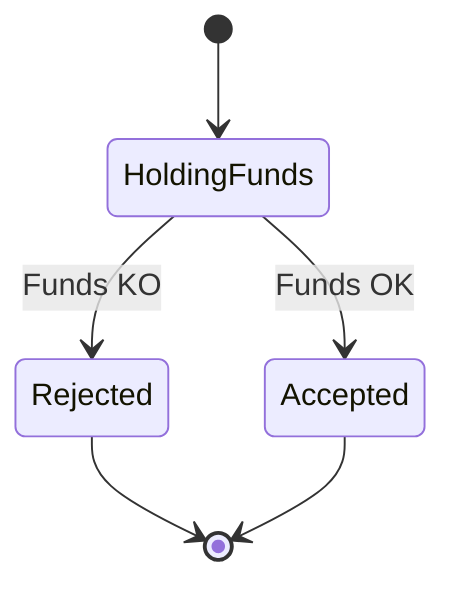
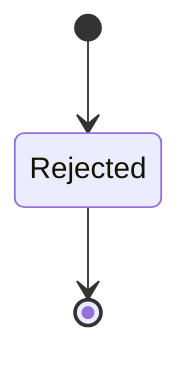
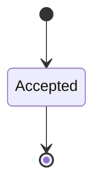
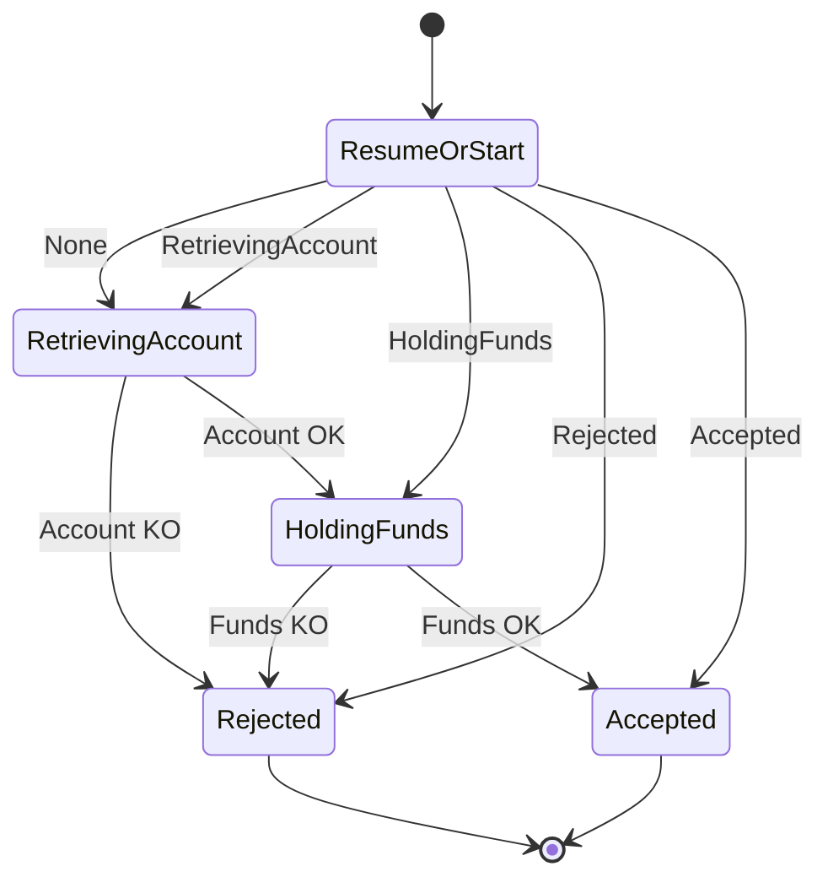
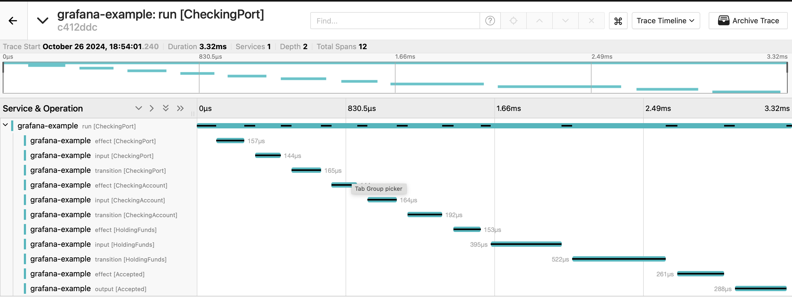
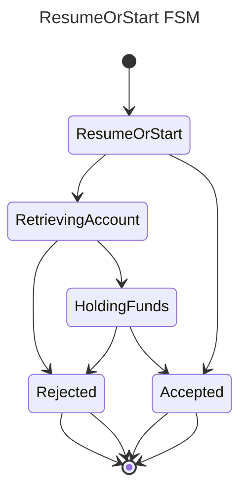

# Building a Finite-State-Machine Scala framework

# Implementation (bis)

Previously we did a first implementation, not covering all of the needs but providing a minimal working example. In this part we’ll improve by making it modular, with a better testing strategy, adding observability and documentation.

## Divide and ~~conquer~~ merge

### Split the FSM into smaller FSMs

It’s always easier to think about small blocks and combining them. Earlier, we only defined one big algebra for the whole FSM. It works but it could be improved. Wouldn’t it be better to be able to define the logic on each state and build the whole FSM by merging all unitary state logics?









What happens here? For each state, we define an algebra. We will provide the type of the next state but not its logic. As you can see, in our initial FSM we had 4 states (2 intermediates and 2 finals) so we’re having 4 unitary FSM. It’s up to the user of the framework to choose its division. I found it easier to test, easier to read and less error prone to explode all the state in their own FSM. But if you’re happy with one big algebra, because there is not that much logic or not that much services to inject, then go for it. In our use case, the logic for the `Rejected` state is re-used two times, for instance. Once when finishing from `RetrievingAccount` and once finishing from `HoldingFunds`, so it might be interesting to factor this code into a single FSM to be able to reuse the same behavior without copy-pasting the code.

```scala
// We're defining unitary FSM here and we'll
// use this empty State0Algebra to encode
// transition without any behavior
def emptyState0Algebra[F[_] : Applicative, S]:
State0Algebra[F, S, S] = new State0Algebra[F, S, S] {
  override def entryAction: Action[F, S] = _ => ().pure
  override def output: Output[S, S] = identity
}

// Given our example, Rejected & Accepted FSM publish to kafka
// and output the state without any modification.
def onRejectedFSM[F[_]]: State0Algebra[F, Rejected, Rejected] = ???
def onAcceptedFSM[F[_]]: State0Algebra[F, Accepted, Accepted] = ???

// HoldingFunds will apply a FundsKO | FundsOK to move to a
// "temporary" State0 Rejected | Accepted. These next states
// doesn't hold any logic. They will have no action and an
// identity function. We'll override this behavior later by
// merging onRejectedFSM + onAcceptedFSM with onHoldingFundsFSM.
def onHoldingFundsFSM[F[_]]: State2Algebra[
  F, HoldingFunds,
  FundsKO | FundsOK,
  Rejected, Rejected,
  Accepted, Accepted,
  State0Algebra[F, Rejected, Rejected],
  State0Algebra[F, Accepted, Accepted]
] = ???

// same as HoldingFunds. Here we provide the logic from
// RetrievingAccount to either Rejected | HoldingFunds.
// As you can see, HoldingFunds became an output algebra
// typed by State0. It's because we just want the next
// state, not the full logic and the iteration of the FSM
// until we reach a final state
def onRetrievingAccount[F[_]]: State2Algebra[
  F, RetrievingAccount,
  AccountKO | AccountOK,
  Rejected, Rejected,
  HoldingFunds, HoldingFunds,
  State0Algebra[F, Rejected, Rejected],
  State0Algebra[F, HoldingFunds, HoldingFunds]
] = ???
```
[https://gist.github.com/AlixBa/2d11f39477fa78bb3657bf83070611fc](https://gist.github.com/AlixBa/2d11f39477fa78bb3657bf83070611fc)

For each state we have, we want to have a StateAlgebra (State0, State1 or State2) followed by as many “empty” `State0Algebra` as needed. We just need to correct typing for the next states but we don’t need to provide any logic attached as it will be overridden later. Good, we now have our blocks, we just need to combine them. 

### Combine FSMs into a bigger FSM

```scala
// How to merge A2 into A1. What we want to achieve here is
// taking two FSMs and merge the `Right` one into the `Left`
// one. Of course, we only want to allow merging if it makes
// sense. So the `Left` FSM should have a state matching the
// `Right` FSM root state. What does this mean?
// We'll only authorize a State0Alg from the `Left` FSM to be
// replaced with a `Right` FSM of the same state.
// State0[S] + State[T] => State0[S] (because states don't match)
// State0[S] + State[S] => State[S] (because states match)
// State1[T->State0[S]] + State[T] => State1[T->State0[S]] (don't match)
// State1[T->State0[S]] + State[S] => State1[T->State[S]] (match)
trait StateAlgebraMerger[
  F[_], S1, O1, S2, O2,
  A1 <: StateAlgebra[F, S1, O1],
  A2 <: StateAlgebra[F, S2, O2]
] {
  // We'll use dependent types here to summon implicitly
  // the StateAlgebraMerger from A1 and A2 and be able
  // to reference the result type later in our program.
  // The output of the merge is a StateAlgebra A3
  type Out
  type A3 <: StateAlgebra[F, S1, Out]

  def apply(algebra1: A1, algebra2: A2): A3
}

// See `Scala Aux pattern` if you don't know what that is.
type Aux[
  F[_], S1, O1, S2, O2,
  A1 <: StateAlgebra[F, S1, O1],
  A2 <: StateAlgebra[F, S2, O2],
  Out0, A30 <: StateAlgebra[F, S1, Out0]
] = StateAlgebraMerger[F, S1, O1, S2, O2, A1, A2] {
  type A3 = A30
  type Out = Out0
}

// used to summon the instance of the merge between two FSMs
def apply[
  F[_], S1, O1, S2, O2,
  A1 <: StateAlgebra[F, S1, O1],
  A2 <: StateAlgebra[F, S2, O2],
](using
  merger: StateAlgebraMerger[F, S1, O1, S2, O2, A1, A2]
 ): Aux[F, S1, O1, S2, O2, A1, A2, merger.Out, merger.A3] =
  merger

// In this case, the state of the `Right` FSM isn't the
// same of the `Left` State0Algebra FSM. So we don't do
// anything.
given state0LMerger[
  F[_], S1, O1, S2, O2,
  A1 <: State0Algebra[F, S1, O1],
  A2 <: StateAlgebra[F, S2, O2]
](using
  ev: NotGiven[S1 =:= S2]
 ): Aux[F, S1, O1, S2, O2, A1, A2, O1, A1] =
  new StateAlgebraMerger[F, S1, O1, S2, O2, A1, A2] {
    override type Out = O1
    override type A3 = A1

    override def apply(algebra1: A1, algebra2: A2): A3 = algebra1
  }

// In this case, the state of the `Right` FSM matches
// the state of the `Left` State0Algebra FSM. So we 
// replace `Left` by `Right`
given state0RMerger[
  F[_], S, O1, O2,
  A1 <: State0Algebra[F, S, O1],
  A2 <: StateAlgebra[F, S, O2]
]: Aux[F, S, O1, S, O2, A1, A2, O2, A2] =
  new StateAlgebraMerger[F, S, O1, S, O2, A1, A2] {
    override type Out = O2
    override type A3 = A2

    override def apply(algebra1: A1, algebra2: A2): A3 = algebra2
  }

// On a State1Algebra, we want to apply the merge on the
// StateAlgebra of the next state. We use recursion and
// implicit resolution here as we don't know the type of
// the next algebra. We use the result of the merger to
// create a new State1Algebra with what has been merged (or not).
given state1Merger[
  F[_], S1, E1, S11, O1, S2, O2,
  A11 <: StateAlgebra[F, S11, O1],
  A1 <: State1Algebra[F, S1, E1, S11, O1, A11],
  A2 <: StateAlgebra[F, S2, O2]
](using
  merger: StateAlgebraMerger[F, S11, O1, S2, O2, A11, A2]
 ): Aux[
  F, S1, O1, S2, O2, A1, A2,
  merger.Out, State1Algebra[F, S1, E1, S11, merger.Out, merger.A3]
] = new StateAlgebraMerger[F, S1, O1, S2, O2, A1, A2] {
  override type Out = merger.Out
  override type A3 = State1Algebra[F, S1, E1, S11, merger.Out, merger.A3]

  override def apply(_algebra1: A1, algebra2: A2): A3 =
    new State1Algebra[F, S1, E1, S11, merger.Out, merger.A3] {
      override def entryAction: Action[F, S1] = _algebra1.entryAction
      override def input: Input[F, S1, E1] = _algebra1.input
      override def transition: Transition[S1, E1, S11] = _algebra1.transition
      override def exitAction: Action[F, (S1, S11)] = _algebra1.exitAction
      override def next: merger.A3 = merger(_algebra1.next, algebra2)
    }
}

// State2Algebra is applying the merger on both possible next states.
// It's the same idea as State1. We're building a new State2Algebra
// with the next1 and next2 algebras replaced with the result of the 
// merge
given state2Merger[
  F[_], S1, E1, S11, O11, S12, O12, S2, O2,
  A11 <: StateAlgebra[F, S11, O11],
  A12 <: StateAlgebra[F, S12, O12],
  A1 <: State2Algebra[F, S1, E1, S11, O11, S12, O12, A11, A12],
  A2 <: StateAlgebra[F, S2, O2]
](using
  merger1: StateAlgebraMerger[F, S11, O11, S2, O2, A11, A2],
  merger2: StateAlgebraMerger[F, S12, O12, S2, O2, A12, A2]
 ): Aux[
  F, S1, O11 | O12, S2, O2, A1, A2,
  merger1.Out | merger2.Out,
  State2Algebra[F, S1, E1, S11, merger1.Out, S12, merger2.Out, merger1.A3, merger2.A3]
] = new StateAlgebraMerger[F, S1, O11 | O12, S2, O2, A1, A2] {
  override type Out = merger1.Out | merger2.Out
  override type A3 = State2Algebra[F, S1, E1, S11, merger1.Out, S12, merger2.Out, merger1.A3, merger2.A3]

  override def apply(_algebra1: A1, _algebra2: A2): A3 =
    new State2Algebra[F, S1, E1, S11, merger1.Out, S12, merger2.Out, merger1.A3, merger2.A3] {
      override def entryAction: Action[F, S1] = _algebra1.entryAction
      override def input: Input[F, S1, E1] = _algebra1.input
      override def transition: Transition[S1, E1, S11 | S12] = _algebra1.transition
      override def exitAction: Action[F, (S1, S11 | S12)] = _algebra1.exitAction
      override def next1: merger1.A3 = merger1(_algebra1.next1, _algebra2)
      override def next2: merger2.A3 = merger2(_algebra1.next2, _algebra2)
    }
}
```
[https://gist.github.com/AlixBa/e6197ec7682f23941d3c579c2a27f45f](https://gist.github.com/AlixBa/e6197ec7682f23941d3c579c2a27f45f)

This might the hardest snippet to read in this article. Fasten your seatbelt as we say in French, and explore what everything does.

We’re starting with the simplest cases. We have a `State0Algebra` on a state S and we're trying to merge with another algebra (whatever the nature, State0, State1, etc). If the other algebra doesn't start with the same state as the `State0Algebra`, then we send back the `State0Algebra` untouched. The merge had no effect. If the other algebra has the same starting state, then we send back the other algebra has it means we merged it into the `State0Algebra`, overriding it. This is pretty much everything we needed as we only want to replace a `State0Algebra` with another algebra.

Now we just need to handle other `Left` algebras (State1, State2). We don't provide a merge that would replace matching states on every algebras. We only want to replace a `Left` `State0Algebra` with another algebra. It simplifies this implementation and makes it explicit that we're not interested in allowing every merge. That being said, when the `Left` algebra is `State1Algebra`, we will apply the merge using a recursion on the `next` algebra of the `State1Algebra`. Then we re-build a `State1Algebra` with the result of the merge. That's why we needed the `StateAlgebraMerger` to send back `Out` and `A3`. `Out` is the new output type and `A3` is the type of the resulting StateAlgebra from the same state to the new output type.

If you got the idea, then State2 shouldn’t be a big deal now. We’re constructing a new `State2Algebra` by using the merge on both next states. And voilà. Let's have a look at how we could use this in our case.

```scala
// merge A2 into A1 using an implicit instance
// of the merger algorithm. We could add this as
// an extension method.
def merge[
  F[_], S1, O1, S2, O2,
  A1 <: StateAlgebra[F, S1, O1],
  A2 <: StateAlgebra[F, S2, O2]
](alg1: A1, alg2: A2)(using
  merger: StateAlgebraMerger[F, S1, O1, S2, O2, A1, A2]
): merger.A3 = merger(alg1, alg2)

// merging all our FSMs and we're back with the 
// same type as the first implementation we did
// in Part 1. We can now compile this using the
// StateProgram and we're back with the same result.
def authorizeCardPaymentFSM[F[_]]: State2Algebra[
  F, RetrievingAccount,
  AccountKO | AccountOK,
  Rejected, Rejected,
  HoldingFunds, Rejected | Accepted,
  State0Algebra[F, Rejected, Rejected],
  State2Algebra[
    F, HoldingFunds,
    FundsKO | FundsOK,
    Rejected, Rejected,
    Accepted, Accepted,
    State0Algebra[F, Rejected, Rejected],
    State0Algebra[F, Accepted, Accepted]
  ]
] = {
  // let's merge the first step with the second step
  // We're left with states RetrievingAccount & HoldingFunds
  // correctly handled
  val m1 = merge(onRetrievingAccount[F], onHoldingFundsFSM[F])
  // then replace all Rejected states with the right implementation
  val m2 = merge(m1, onRejectedFSM[F])
  // finish with replacing Accepted state
  val m3 = merge(m2, onAcceptedFSM[F])
  //
  m3
}
```
[https://gist.github.com/AlixBa/b2c5c1dbd4879038279cd62f946dcb1a](https://gist.github.com/AlixBa/b2c5c1dbd4879038279cd62f946dcb1a)

## Testing

Was it worth it? It became a little bit complex from the framework point of view. Having this merge algorithm is not a beginner code and if it had to be modified on a regular basis it could be something more detrimental than useful. On the other hand, let’s see what are the impacts on the testing side as we already proved that we had more expressivity doing this split.

```scala
// We'll start using proper dependency injection
// to make it closer to what production code should
// be. Here is the abstraction over our service to
// holds funds on an account.
case class InsufficientFunds(before: BigDecimal, after: BigDecimal)
case class Held(after: BigDecimal)
trait HoldingFundsService[F[_]] {
  def holdFunds(
    accountId: String,
    amount: BigDecimal
  ): F[Either[InsufficientFunds, Held]]
}
// and here what we need to persist a state
trait PersistState[F[_], State] {
  def persist(state: State): F[Unit]
}

// our FSM on the HoldingFunds state.
def onHoldingFundsFSM[F[_]: [G[_]] =>> ApplicativeError[G, Throwable]](
    service: HoldingFundsService[F],
    persistR: PersistState[F, Rejected],
    persistA: PersistState[F, Accepted],
): State2Algebra[
  F, HoldingFunds,
  FundsKO | FundsOK,
  Rejected, Rejected,
  Accepted, Accepted,
  State0Algebra[F, Rejected, Rejected],
  State0Algebra[F, Accepted, Accepted]
] = new State2Algebra[
  F, HoldingFunds,
  FundsKO | FundsOK,
  Rejected, Rejected,
  Accepted, Accepted,
  State0Algebra[F, Rejected, Rejected],
  State0Algebra[F, Accepted, Accepted]
] {
  override def entryAction: Action[F, HoldingFunds] = _ => ().pure
  override def input: Input[F, HoldingFunds, FundsKO | FundsOK] = state =>
    service.holdFunds(state.accountId, state.amount).map {
      case Left(ko) => FundsKO(ko.before, ko.after)
      case Right(ok) => FundsOK(ok.after)
    }
  // this could be taken out of this and be properly unit tested
  // so we don't have to initiate a FSM to test a simple mapping
  override def transition: Transition[HoldingFunds, FundsKO | FundsOK, Rejected | Accepted] = {
    case (state, _: FundsKO) => Rejected(state.cardId, state.amount, Reason.InsufficientFunds)
    case (state, ok: FundsOK) => Accepted(state.cardId, state.amount, state.accountId, ok.balance)
  }
  override def exitAction: Action[F, (HoldingFunds, Rejected | Accepted)] = {
    case (_, rejected: Rejected) => persistR.persist(rejected).recover(_ => ())
    case (_, accepted: Accepted) => persistA.persist(accepted).recover(_ => ())
  }
  override def next1: State0Algebra[F, Rejected, Rejected] =
    // "empty" (no specific behavior here)
    new State0Algebra[F, Rejected, Rejected] {
      override def entryAction: Action[F, Rejected] = _ => ().pure
      override def output: Output[Rejected, Rejected] = identity
    }
  override def next2: State0Algebra[F, Accepted, Accepted] =
    // "empty" (no specific behavior here)
    new State0Algebra[F, Accepted, Accepted] {
      override def entryAction: Action[F, Accepted] = _ => ().pure
      override def output: Output[Accepted, Accepted] = identity
    }
}
```
[https://gist.github.com/AlixBa/5e87ecb3789fd1c59959eaafcc985df6](https://gist.github.com/AlixBa/5e87ecb3789fd1c59959eaafcc985df6)

First, let’s define what the FSM on HoldingFunds looks like. As explained previously, we don’t put any logic after the transition to `next1` or `next2`. We just want to make sure we reach this state. The merge will override this algebra by another one. In this snippet we finally added an action, at exiting time. When the transition will be done, we'll persist the new state somewhere. This has two purpose, the first one is to be able to resume a stopped FSM execution to a state already reached so we avoid idempotency issues and we improve performances. The second one is to save each reached states with metadata so we have a trace of everything happening in the system in a more detailed view than just the initial and final state of a FSM.

```scala
// let's define our external services first
// We want to fail on the persistence on the
// exitAction and send back an InsufficientFunds
// from the service.
def failingPersist[S]: PersistState[Try, S] = (state: S) =>
  Failure[Unit](new NotImplementedError(""))

val service: HoldingFundsService[Try] = (accountId: String, amount: BigDecimal) =>
  Success[Either[InsufficientFunds, Held]](Left(InsufficientFunds(0, -amount)))

val onHoldingFundsTryFSM: HoldingFunds => Try[Rejected | Accepted] =
  program(onHoldingFundsFSM[Try](
    service = service,
    persistR = failingPersist[Rejected],
    persistA = failingPersist[Accepted]
  )).run(_: HoldingFunds)

// given the FSM at the HoldingFunds state
// when the account has not enough funds
// then the FSM moves to Rejected
// and any error on the persistence step is
// recovered
val execution = onHoldingFundsTryFSM(HoldingFunds("cardId", 1, "accountId"))

// Success(Rejected("cardId", 1, "InsufficientFunds")): Try[Rejected | Accepted]
execution match {
  case Failure(exception) => // fail(exception) if you were in your test runner
  case Success(_: Accepted) => // fail()
  case Success(rejected: Rejected) =>
    assert(rejected.reason == Reason.InsufficientFunds)
}
```
[https://gist.github.com/AlixBa/63ce95ae4a92e2628849df51f76062b1](https://gist.github.com/AlixBa/63ce95ae4a92e2628849df51f76062b1)

You’re not looking at a test snippet per-se. As I intend to put all of this on a scastie again — and scastie is a single file link —, you’re looking at a test like snippet without the test framework to run it. But that’s basically how big it will be in our cases. As we’ll most likely test input, actions and transitions function on their own, testing the FSM is justing making sure that one state and one event transitions to the correct next state. That’s it. If we had to test the whole FSM we would have to mock/initialize/inject all dependencies, not being able to test every branching as we would only input the initial state and get the final state in output. I feel like it’s a little plus, balancing the complexity of the `StateAlgebraMerger`. Do you feel the same?

## Resume or Start*

* Part 4 will add a reflexion on this topic, providing another solution



For several reasons we said that we would like to be able to persist states and restart a previously stopped execution (server crash, for instance) from its last state. 

First, because every time we call the service to fetch the account, the result can be different. At T0 it could be `AccountOK` but at T+1 it could be `AccountKO(reason: Closed)`(very unlucky, between 2 executions the status changed). But if we had initiated a movement on the account of the user, we don't want to mark this payment as rejected, so we have to take the same path/branch in the FSM. In this case we save the state to always take the same decision. 

Second, because it's a way to provide an audit on a specific payment. By saving each state of the FSM we also save why every decision was taken, along with their timestamps. It could be redundant with some kind of tracing but they don’t have the same goal and don’t provide the same guarantees. Here we’ll save in database and will be permanent. We wouldn’t provide permanent persistence on our tracing system.

And third because of performance. Sometimes, it happens that a request is replayed. Usually this happens when the first try is taking more time than expected or when the response got lost somehow (network issues). By having this persistence we provide an idempotent & performant mechanism to answer.

```scala
// The new State we're adding in the FSM
case class ResumeOrStart(ifNone: RetrievingAccount)

// how to fetch a persisted state. We have all the
// states of the FSM here, as we defined requirements
// on both auditability and idempotency.
trait GetPreviousState[F[_]] {
  def get(): F[Option[RetrievingAccount | HoldingFunds | Rejected | Accepted]]
}

// If we use the assumption that we are saving all the possible
// states of the FSM, this should be a State4Algebra. Because we
// could get, from the persistence layer, either CheckingAccount,
// or HoldingFunds, or Rejected or Accepted. But we didn't define
// this State4Algebra. so let's assume that we're only persisting
// when we reach the final state Accepted. This means this FSM is
// a State2Algebra. Either we persisted an Accepted and we start
// from there. Or we didn't persist anything, and we'll start from
// CheckingAccount.
def resumeOrStartFSM[F[_] : Applicative](
  getPreviousState: GetPreviousState[F]
): State2Algebra[
  F, ResumeOrStart, RetrievingAccount | Accepted,
  RetrievingAccount, RetrievingAccount, Accepted, Accepted,
  State0Algebra[F, RetrievingAccount, RetrievingAccount],
  State0Algebra[F, Accepted, Accepted]
] = new State2Algebra[
  F, ResumeOrStart, RetrievingAccount | Accepted,
  RetrievingAccount, RetrievingAccount, Accepted, Accepted,
  State0Algebra[F, RetrievingAccount, RetrievingAccount],
  State0Algebra[F, Accepted, Accepted]
] {
  override def entryAction: Action[F, ResumeOrStart] = _ => ().pure
  override def input: Input[F, ResumeOrStart, RetrievingAccount | Accepted] = state =>
    getPreviousState.get().map {
      case Some(accepted: Accepted) => accepted
      // as we don't have a State4Algebra we'll
      // not match other Some(_)
      case _ => state.ifNone
    }
  override def transition: Transition[ResumeOrStart, RetrievingAccount | Accepted, RetrievingAccount | Accepted] = {
    case (_, event) => event
  }
  override def exitAction: Action[F, (ResumeOrStart, RetrievingAccount | Accepted)] = _ => ().pure
  override def next1: State0Algebra[F, RetrievingAccount, RetrievingAccount] =
    new State0Algebra[F, RetrievingAccount, RetrievingAccount] {
      override def entryAction: Action[F, RetrievingAccount] = _ => ().pure
      override def output: Output[RetrievingAccount, RetrievingAccount] = identity
    }
  override def next2: State0Algebra[F, Accepted, Accepted] =
    new State0Algebra[F, Accepted, Accepted] {
      override def entryAction: Action[F, Accepted] = _ => ().pure
      override def output: Output[Accepted, Accepted] = identity
    }
}
```
[https://gist.github.com/AlixBa/d5f0751bfc0a32cc321d95a0552bddf2](https://gist.github.com/AlixBa/d5f0751bfc0a32cc321d95a0552bddf2)

You should start to understand how this works now. We’re declaring a new state along with the logic on this state. Here I had to simplify because `State4Algebra` hasn't been defined. Read the comments as I'll not double explain what is happening in this simplification. Then we plug it to the existing FSM.

```scala
def authorizeCardPaymentWithResumeFSM[F[_]: [G[_]] =>> ApplicativeError[G, Throwable]](
  getPreviousState: GetPreviousState[F]
): State2Algebra[
  F, ResumeOrStart, RetrievingAccount | Accepted,
  RetrievingAccount, Rejected | Accepted, Accepted, Accepted,
  State2Algebra[
    F, RetrievingAccount, AccountKO | AccountOK,
    Rejected, Rejected, HoldingFunds, Rejected | Accepted,
    State0Algebra[F, Rejected, Rejected],
    State2Algebra[
      F, HoldingFunds, FundsKO | FundsOK,
      Rejected, Rejected, Accepted, Accepted,
      State0Algebra[F, Rejected, Rejected],
      State0Algebra[F, Accepted, Accepted]
    ]
  ],
  State0Algebra[F, Accepted, Accepted]
] = {
  // reconstruct from zero
  // val m0 = merge(resumeOrStartFSM[F](getPreviousState), onRetrievingAccount[F])
  // val m1 = merge(m0, onHoldingFundsFSM[F])
  // val m2 = merge(m1, onRejectedFSM[F])
  // val m3 = merge(m2, onAcceptedFSM[F])
  // m3

  // or wrap the existing implementation
  val m0 = merge(resumeOrStartFSM[F](getPreviousState), fsm[F])
  // we need to do this again to put the correct
  // behavior when transitioning to Accepted
  val m1 = merge(m0, onAcceptedFSM[F]) 
  // and we would need this if all states were available
  // val m2 = merge(m1, onHoldingFundsFSM[F])
  // val m3 = merge(m2, onRejectedFSM[F])
  // ...
  // which makes it a little bit confusing.
  // It could be improved. See Part 4. for this
  m1
}
```
[https://gist.github.com/AlixBa/f2e053bdf9235d2f34241c0822a8667d](https://gist.github.com/AlixBa/f2e053bdf9235d2f34241c0822a8667d)

To choices here to get the extended FSM. Either by reconstructing everything, which is an option if you have access to every unitary FSM. I would say this is the recommended way to do it. Why? Because you should only build your FSM once by composing smaller FSMs. This is the declaration of your final codebase. By splitting the declaration at several places, it makes it difficult to reason about why the final code is doing. But as we could also see this extension as a technical tooling around a business FSM (and so an FSM agnostic wrapper), I’ll show how to compose with wrapping the FSM we defined in Part 1. It’s perfectible as explained in the comments and we’ll see this later.

What does it change to existing code base? Nothing. As everything was decoupled already, you don’t need to modify tests, you don’t need to be afraid of breaking the existing FSM. And I think that is what makes it cool. What’s cool also, is that, by never enforcing any type, such as `State` or `Event`, we can reuse anything as an Input. See how on the state `ResumeOrStart` we reused the next states `RetrievingAccount`, `HoldingFunds`, etc? And it feels natural to read, at least I feel like it does: On state `ResumeOrStart`, if I get any persisted state from the persistence layer, I use this state as the next state of the FSM. If I don't, then I start the FSM with the "normal" state, `RetrievingAccount`

```scala
// compile & run
// Success(Accepted("cardId", 1, "accountId", 0)
program(authorizeCardPaymentWithResumeFSM[Try](
  () => Success(Some(Accepted("cardId", 1, "accountId", 0)))
)).run(ResumeOrStart(RetrievingAccount("unusedCardId", 1)))

// Success(Rejected("unknownCardId, 1, "AccountNotFound"))
program(authorizeCardPaymentWithResumeFSM[Try](
  () => Success(None)
)).run(ResumeOrStart(RetrievingAccount("unknownCardId", 1)))
```
[https://gist.github.com/AlixBa/8166f699cbe5f63abe1d83e8bdbe7181](https://gist.github.com/AlixBa/8166f699cbe5f63abe1d83e8bdbe7181)

## Telemetry

Now that we’ve got something we can use to declare, compose and run a FSM, let’s focus on Telemetry. By telemetry I have logging, tracing and metrics in mind. In this section I’ll focus on logging. We’ll provide one implementation of a Logger which given a StateProgram will log everything happening, at each state, for each step of a state. I will not provide any example of tracing and metrics because it would be redundant as the code would look very similar. For the record, we will use otel4s to provide a traced program internally.

```scala
// defining some king of Logger as I don't want to pull
// another dependency. logs4cats would do the trick.
trait Logger[F[_]] {
  def debug(msg: String): F[Unit]
  def info(msg: String): F[Unit]
}

object Logger {
  def apply[F[_]](using l: Logger[F]): Logger[F] = l
}

// Typeclass to log recursively an A
trait StateRecursiveTextLogger[A] {
  def logR(a: A): A
}

// Implicit instance to log a State0Algebra
given state0AlgebraLogger[F[_] : FlatMap : Logger, S, O]
: StateRecursiveTextLogger[State0Algebra[F, S, O]] =
  (algebra: State0Algebra[F, S, O]) =>
    new State0Algebra[F, S, O] {
      val L: Logger[F] = Logger[F]
      override def entryAction: Action[F, S] = (s: S) =>
        for {
          _ <- L.debug(s"--> Applying action on [$s]")
          e <- algebra.entryAction(s)
          _ <- L.debug(s"<-- Action applied on [$s]")
        } yield e

      override def output: Output[S, O] = algebra.output
    }

// Implicit instance to log a State1Algebra
// and recursive logger on the next StateAlgebra
given state1AlgebraLogger[
  F[_] : FlatMap : Logger, S0, E, S1, O1,
  A1 <: StateAlgebra[F, S1, O1]
](using
  log1: StateRecursiveTextLogger[A1]
 ): StateRecursiveTextLogger[State1Algebra[F, S0, E, S1, O1, A1]] =
  (algebra: State1Algebra[F, S0, E, S1, O1, A1]) =>
    new State1Algebra[F, S0, E, S1, O1, A1] {
      val L: Logger[F] = Logger[F]
      override def entryAction: Action[F, S0] = (s0: S0) =>
        for {
          _ <- L.debug(s"--> Applying entry action on [$s0]")
          e <- algebra.entryAction(s0)
          _ <- L.debug(s"<-- Entry action applied on [$s0]")
        } yield e
      override def input: Input[F, S0, E] = (s0: S0) =>
        for {
          _ <- L.debug(s"--> Calling input on [$s0]")
          i <- algebra.input(s0)
          _ <- L.debug(s"<-- Got event [$i] on [$s0]")
        } yield i
      override def transition: Transition[S0, E, S1] = algebra.transition
      override def exitAction: Action[F, (S0, S1)] = (s0: S0, s1: S1) =>
        for {
          _ <- L.debug(s"--> Applying exit action on [$s0] -> [$s1]")
          u <- algebra.exitAction(s0, s1)
          _ <- L.debug(s"<-- Exit action applied on [$s0] -> [$s1]")
        } yield u
      override def next: A1 = log1.logR(algebra.next)
    }

// Log a State2Algebra + next1 & next2
given state2AlgebraLogger[
  F[_] : FlatMap : Logger, S0, E, S1, O1, S2, O2,
  A1 <: StateAlgebra[F, S1, O1],
  A2 <: StateAlgebra[F, S2, O2],
](using
  log1: StateRecursiveTextLogger[A1],
  log2: StateRecursiveTextLogger[A2]
 ): StateRecursiveTextLogger[State2Algebra[F, S0, E, S1, O1, S2, O2, A1, A2]] =
  (algebra: State2Algebra[F, S0, E, S1, O1, S2, O2, A1, A2]) =>
    new State2Algebra[F, S0, E, S1, O1, S2, O2, A1, A2] {
      val L: Logger[F] = Logger[F]
      override def entryAction: Action[F, S0] = (s0: S0) =>
        for {
          _ <- L.debug(s"--> Applying entry action on [$s0]")
          e <- algebra.entryAction(s0)
          _ <- L.debug(s"<-- Entry action applied on [$s0]")
        } yield e
      override def input: Input[F, S0, E] = (s0: S0) =>
        for {
          _ <- L.debug(s"--> Calling input on [$s0]")
          i <- algebra.input(s0)
          _ <- L.debug(s"<-- Got event [$i] on [$s0]")
        } yield i
      override def transition: Transition[S0, E, S1 | S2] = algebra.transition
      override def exitAction: Action[F, (S0, S1 | S2)] = (s0: S0, s1s2: S1 | S2) =>
        for {
          _ <- L.debug(s"--> Applying exit action on [$s0] -> [$s1s2]")
          u <- algebra.exitAction(s0, s1s2)
          _ <- L.debug(s"<-- Exit action applied on [$s0] -> [$s1s2]")
        } yield u
      override def next1: A1 = log1.logR(algebra.next1)
      override def next2: A2 = log2.logR(algebra.next2)
    }

// Also provide an instance to log a program if that is
// what you want to log. It will log the Algebra recursively.
given stateProgramLogger[
  F[_] : FlatMap : Logger, S, O,
  A <: StateAlgebra[F, S, O]
](using
  logA: StateRecursiveTextLogger[A]
 ): StateRecursiveTextLogger[StateProgram[F, S, O, A]] =
  (program: StateProgram[F, S, O, A]) =>
    new StateProgram[F, S, O, A] {
      val L: Logger[F] = Logger[F]
      override def run(algebra: A)(s: S): F[O] =
        for {
          _ <- L.info(s"--> Running program on [$s]")
          o <- program.run(logA.logR(algebra))(s)
          _ <- L.info(s"<-- Ran program on [$s] with [$o]")
        } yield o
    }

given stateProgramWithAlgebraLogger[
  F[_] : FlatMap : Logger, S, O,
  A <: StateAlgebra[F, S, O]
](using
  log: StateRecursiveTextLogger[StateProgram[F, S, O, A]]
 ): StateRecursiveTextLogger[StateProgramWithAlgebra[F, S, O, A]] =
  (program: StateProgramWithAlgebra[F, S, O, A]) =>
    new StateProgramWithAlgebra[F, S, O, A] {
      val L: Logger[F] = Logger[F]
      override def algebra: A = program.algebra
      override def run(algebra: A)(s: S): F[O] =
        log.logR(program).run(algebra)(s)
    }
```
[https://gist.github.com/AlixBa/66d4fc26ba00a927907ffa7a5fe1391f](https://gist.github.com/AlixBa/66d4fc26ba00a927907ffa7a5fe1391f)

Remember what we did on `StateProgram`? Declining all possible types we want to compile into a runnable function? We're doing the same here. We define an implicit implementation on all the types we want to provide a recursive logger. We used a simple string message here, the point is not about having the best logging but rather show what it looks like to wrap an existing behavior with logging. As you can see we are re-creating the algebras and the programs by just adding a few logs before and after each functions.

```scala
// as usual, this could be an extension method
def logAsTextR[A](a: A)(using logger: StateRecursiveTextLogger[A]): A = logger.logR(a)

// don't do this at home
given Logger[Try] = new Logger[Try] {
  override def debug(msg: String): Try[Unit] = Try(println(msg))
  override def info(msg: String): Try[Unit] = Try(println(msg))
}

// re-build a program by adding a recursive logging
val loggedProgram = logAsTextR(program(
  authorizeCardPaymentWithResumeFSM[Try](() => Success(None))
))

/*
--> Running program on [ResumeOrStart(RetrievingAccount(unusedCardId,1))]
--> Applying entry action on [ResumeOrStart(RetrievingAccount(unusedCardId,1))]
<-- Entry action applied on [ResumeOrStart(RetrievingAccount(unusedCardId,1))]
--> Calling input on [ResumeOrStart(RetrievingAccount(unusedCardId,1))]
<-- Got event [RetrievingAccount(unusedCardId,1)] on [ResumeOrStart(RetrievingAccount(unusedCardId,1))]
--> Applying exit action on [ResumeOrStart(RetrievingAccount(unusedCardId,1))] -> [RetrievingAccount(unusedCardId,1)]
<-- Exit action applied on [ResumeOrStart(RetrievingAccount(unusedCardId,1))] -> [RetrievingAccount(unusedCardId,1)]
--> Applying entry action on [RetrievingAccount(unusedCardId,1)]
<-- Entry action applied on [RetrievingAccount(unusedCardId,1)]
--> Calling input on [RetrievingAccount(unusedCardId,1)]
<-- Got event [AccountKO()] on [RetrievingAccount(unusedCardId,1)]
--> Applying exit action on [RetrievingAccount(unusedCardId,1)] -> [Rejected(unusedCardId,1,AccountNotFound)]
<-- Exit action applied on [RetrievingAccount(unusedCardId,1)] -> [Rejected(unusedCardId,1,AccountNotFound)]
--> Applying action on [Rejected(unusedCardId,1,AccountNotFound)]
<-- Action applied on [Rejected(unusedCardId,1,AccountNotFound)]
<-- Ran program on [ResumeOrStart(RetrievingAccount(unusedCardId,1))] with [Rejected(unusedCardId,1,AccountNotFound)]
 */
loggedProgram.run(ResumeOrStart(RetrievingAccount("unusedCardId", 1)))
```
[https://gist.github.com/AlixBa/1e3aa28e0b8c56462923e74d2637e1df](https://gist.github.com/AlixBa/1e3aa28e0b8c56462923e74d2637e1df)

Once again, here, we use wrapping an existing behavior to add logging. This way, developers don’t need to add generic logging on top of their FSM. If they want custom logging for a specific side-effect, it’s possible. But by default, we’ll provide an implementation of a logger so they don’t have to worry about this and it will provide a standard way of logging in production.



Example of tracing a FSM

This tracing screenshot is using an old version of the framework (effect=entryAction, transition=transition+exitAction) but you can see what it would look like to implement a tracing on top of a FSM. In each step of the creation of the framework we took care of separating each concept in its own part (declaration, execution, composition, observability) and we tried to keep as much information in the type as possible. By doing so it’s now super easy to add behaviors on top of this.

## Documentation

Documentation is always a tricky point in programming. We want documentation because it helps both developers and readers to understand what’s happening. It provides useful information the code might not reflect at first sight. But documentation is hard to maintain, to keep in track with the code. What about we generate the documentation from the code? And what about we do it using schemas? Schemas are easy to read and most of the people can understand a good schema. 

```scala
trait StateDiagram[A] {
  def diagram: Seq[String]
}

given state0AlgebraDiagram[F[_], S, O](using
  ct: ClassTag[S]
): StateDiagram[State0Algebra[F, S, O]] =
  new StateDiagram[State0Algebra[F, S, O]] {
    override val diagram: Seq[String] = Vector(
      s"  ${ct.runtimeClass.getSimpleName} --> [*]"
    )
  }

given state1AlgebraDiagram[
  F[_], S0, E, S1, O1,
  A1 <: StateAlgebra[F, S1, O1]
](using
  ct0: ClassTag[S0],
  ct1: ClassTag[S1],
  diagram1: StateDiagram[A1]
 ): StateDiagram[State1Algebra[F, S0, E, S1, O1, A1]] =
  new StateDiagram[State1Algebra[F, S0, E, S1, O1, A1]] {
    override val diagram: Seq[String] = Vector(
      s"  ${ct0.runtimeClass.getSimpleName} --> ${ct1.runtimeClass.getSimpleName}"
    ) ++ diagram1.diagram
  }

given state2AlgebraDiagram[
  F[_], S0, E, S1, O1, S2, O2,
  A1 <: StateAlgebra[F, S1, O1],
  A2 <: StateAlgebra[F, S2, O2],
](using
  ct0: ClassTag[S0],
  ct1: ClassTag[S1],
  ct2: ClassTag[S2],
  diagram1: StateDiagram[A1],
  diagram2: StateDiagram[A2]
 ): StateDiagram[State2Algebra[F, S0, E, S1, O1, S2, O2, A1, A2]] =
  new StateDiagram[State2Algebra[F, S0, E, S1, O1, S2, O2, A1, A2]] {
    override val diagram: Seq[String] = Vector(
      s"  ${ct0.runtimeClass.getSimpleName} --> ${ct1.runtimeClass.getSimpleName}",
      s"  ${ct0.runtimeClass.getSimpleName} --> ${ct2.runtimeClass.getSimpleName}"
    ) ++ diagram1.diagram
      ++ diagram2.diagram
  }

given stateProgramDiagram[F[_], S, O, A <: StateAlgebra[F, S, O]](using
  ct: ClassTag[S],
  diagramA: StateDiagram[A]
): StateDiagram[StateProgram[F, S, O, A]] =
  new StateDiagram[StateProgram[F, S, O, A]] {
    override val diagram: Seq[String] = Vector(
      "---",
      s"title: ${ct.runtimeClass.getSimpleName} FSM",
      "---",
      "stateDiagram-v2",
      s"  [*] --> ${ct.runtimeClass.getSimpleName}"
    ) ++ diagramA.diagram
  }

given stateProgramWithAlgebraDiagram[
  F[_], S, O,
  A <: StateAlgebra[F, S, O]
](using
  diagramA: StateDiagram[StateProgram[F, S, O, A]]
 ): StateDiagram[StateProgramWithAlgebra[F, S, O, A]] =
  new StateDiagram[StateProgramWithAlgebra[F, S, O, A]] {
    override val diagram: Seq[String] = diagramA.diagram
  }
```
[https://gist.github.com/AlixBa/bded2ab962afd0fa9469c6ac95ccd5c7](https://gist.github.com/AlixBa/bded2ab962afd0fa9469c6ac95ccd5c7)

Straight to the point, no comment this time. You know the deal: a type class, several implementations and here we go. Again it’s basic, the idea is just to show how to do it, not to have top quality state diagram in output. Wondering what’s the output of this? Let’s run it against our latest program, the one we added logging to.

```scala
def diagram[A](a: A)(using diagram: StateDiagram[A]): String = diagram.diagram.mkString("\n")
/*
  ---
  title: ResumeOrStart FSM
  ---
  stateDiagram-v2
    [*] --> ResumeOrStart
    ResumeOrStart --> RetrievingAccount
    ResumeOrStart --> Accepted
    RetrievingAccount --> Rejected
    RetrievingAccount --> HoldingFunds
    Rejected --> [*]
    HoldingFunds --> Rejected
    HoldingFunds --> Accepted
    Rejected --> [*]
    Accepted --> [*]
    Accepted --> [*]
 */
diagram(loggedProgram)
```
[https://gist.github.com/AlixBa/00a8083d81406f85dc390183eed0aba7](https://gist.github.com/AlixBa/00a8083d81406f85dc390183eed0aba7)



As you can see, it could be improved. First we have duplicates in the list of generated transitions. We’re also missing which event triggers which transition. We could also improve our Actions to have a name or a meaningful class so we could extend this schema to show both entry and exit actions on each state. Lot of possibilities here.

And it’s time for the conclusion, in Part 4.